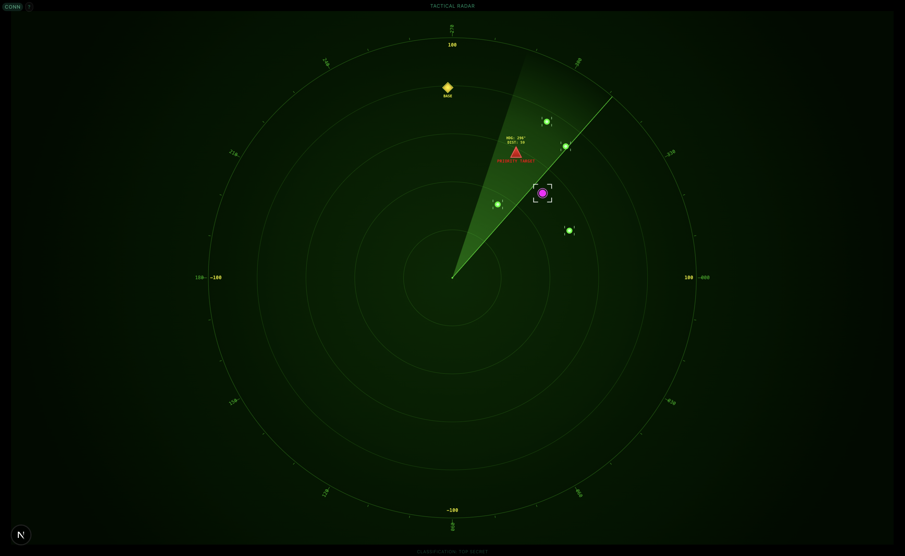

# TATTICO: Tactical Radar Coordination System

A distributed multi-unit coordination system for autonomous sensor and strike operations. Built for the Helsing Coordination Challenge (LDTH 2025).



## Overview

TATTICO provides a C2 (Command and Control) interface for multiple-sensor-based tactical operations with automated target acquisition and strike execution. The system enables real-time coordination between distributed sensor assets and strike components operating in contested environments.

## Capabilities

- **Multi-sensor data fusion**: Integrates data from 4 autonomous sensor units to triangulate hostile target positions with high accuracy
- **Real-time tactical radar display**: Web sockets visualization of battlespace components including sensor units, strike platforms, and targets
- **Autonomous strike management**: Blind strike unit navigation based on distributed sensor network intelligence

## Technical Architecture

TATTICO employs a distributed, event-driven architecture with the following components:

1. **Distributed Sensor Network**: Python-based sensor control logic with independent messaging capabilities
2. **Strike Control System**: Specialized navigation algorithms for pathfinding based on sensor intelligence  
3. **Tactical Radar Interface**: Next.js/React frontend with WebSocket-based real-time updates
4. **Battlefield Simulation**: Physics-based simulation for testing coordination protocols

### Technical Implementation

- **PID Controllers**: Strike unit navigation employs Proportional-Integral-Derivative control loops to maintain optimal intercept trajectories while accounting for inertia. The PID parameters are dynamically adjusted based on distance-to-target to ensure smooth approach and high strike probability.

- **Context Sharing Protocol**: Sensor units implement a distributed redundant messaging system with an n×3 replication factor. Each detection is broadcast with confidence metrics and timestamps to enable distributed consensus on target positions despite incomplete local information.

- **WebSocket Event Loop Management**

- **Spatial Partitioning**: The battlefield space employs quad-tree partitioning to optimize collision detection and target identification.

### Data Flow

```
+---------------+    +----------------+    +---------------------+
| Sensor Units  |<-->| Message Broker |<-->| Strike Control Unit |
+---------------+    +----------------+    +---------------------+
                            |
                            v
                    +----------------+
                    | WebSocket API  |
                    +----------------+
                            |
                            v
                    +----------------+
                    | Tactical Radar |
                    +----------------+
```

## Operations Guide

### System Deployment

1. Start the battlefield simulation:
   ```
   python src/main.py
   ```

2. Launch the tactical radar interface:
   ```
   cd ui/radar-ui && npm run dev
   ```

3. Connect to the radar at `http://localhost:3000`

### Operational Controls

The tactical radar interface provides real-time visualization of:
- Sensor units (blue indicators)
- Strike platforms (magenta indicators)
- Base position (green indicator)
- Target acquisition data (red triangular indicators)

---

*Developed for the London Defence Tech Hackathon (May 2025)*
